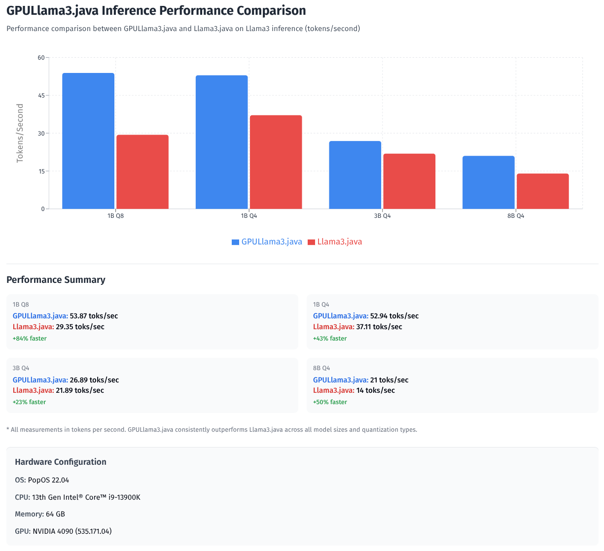

# GPULlama3.java powered by TornadoVM


[//]: # (![Last Commit]&#40;https://img.shields.io/github/last-commit/beehive-lab/GPULlama3.java?style=for-the-badge&#41;)

[//]: # (![Stars]&#40;https://img.shields.io/github/stars/beehive-lab//GPULlama3.java?style=social&#41;)

[//]: # (![Forks]&#40;https://img.shields.io/github/forks/beehive-lab//GPULlama3.java?style=social&#41;)

-----------
<table style="border: none;">
<tr style="border: none;">
<td style="width: 40%; vertical-align: middle; border: none;">

</td>
<td style="vertical-align: middle; padding-left: 20px; border: none;">
Integration of <strong>Llama3 models</strong> with <strong>TornadoVM</strong> to enable accelerated inference on Java using GPUs and CPUs. This project allows you to run Llama3 inference efficiently, leveraging TornadoVM's parallel computing features for enhanced performance.
<br><br>
This project builds on <a href="https://github.com/mukel/llama3.java">Llama3.java</a>, based on the original <a href="https://github.com/meta-llama/llama3">Llama 3</a>, <a href="https://llama.meta.com/docs/model-cards-and-prompt-formats/llama3_1">3.1</a>, and <a href="https://ai.meta.com/blog/llama-3-2-connect-2024-vision-edge-mobile-devices/">3.2</a> models, with TornadoVM support for parallelism and hardware acceleration.
<br><br>
Thanks to @mukel for the original implementation of LLama3.java.
<br><br>
Previous intergration of TornadoVM and Llama2 it can be found in <a href="https://github.com/mikepapadim/llama2.tornadovm.java">llama2.tornadovm</a>.
</td>
</tr>
</table>

-----------

### ✅ Current Features

- **TornadoVM-accelerated Llama 3 inference** with pure Java
  - **Support for GGUF format models** with Q8_0 and Q4_0 quantization
  - **Instruction-following and chat modes** for various use cases
  - **Cross-platform compatibility**:
    - ✅ NVIDIA GPUs (OpenCL & PTX (Soon))
  - **Interactive CLI** with `--interactive` and `--instruct` modes
  - **Flexible backend switching** - choose OpenCL or PTX at runtime (need to build TornadoVM with both enabled)

### 🚧 Work-in-progress Features
<details>
- [ ] **Additional architectures and model format**
  - [ ] Mistral/Mixtral models
  - [ ] Gemma/Gemma2 models
  - [ ] Phi models
  - [ ] SmolLM
  - [ ] TinyLlama
  - [ ] SafeTensors format
  - [ ] PyTorch checkpoint loading
  - [ ] Automatic model conversion utilities
- [ ] **Additional quantization formats**
  - [ ] INT8
  - [ ] FP16 support
- [ ] **Advanced inference capabilities**
  - [ ] Batch inference support
  - [ ] Speculative decoding
- [ ] **Performance optimizations**
  - [ ] Multi-GPU support
  - [ ] Memory-efficient attention mechanisms
  - [ ] Kernel fusion improvements
- [ ] **LangChain4j integration**
- [ ] **GraalVM Native Image**
</details>

-----------

## Setup & Configuration

### Prerequisites

Ensure you have the following installed and configured:

- **Java 21+**: Required for Vector API support.
- **TornadoVM**: To install **TornadoVM**, you'll need to set up the environment variables `TORNADO_ROOT` and `TORNADO_SDK` as part of the configuration process.
  For detailed installation instructions, visit the [TornadoVM GitHub repository](https://github.com/beehive-lab/TornadoVM).
- **Maven**: For building the Java project.

### Install, Build, and Run

When cloning this repository, use the `--recursive` flag to ensure that TornadoVM is properly included as submodule:

```bash
# Clone the repository with all submodules
git clone --recursive git@github.com:mikepapadim/GPULlama3.java.git

# Navigate to the project directory
cd GPULlama3.java

# Enter the TornadoVM submodule directory
cd external/tornadovm

# Optional: Create and activate a Python virtual environment if needed
python3 -m venv venv
source ./venv/bin/activate

# Install TornadoVM with OpenCL backend and OpenJDK 21 [Optional] -> --backend opencl,ptx 
# Be sure to have the correct JDK version installed and the TornadoVM installer script is executed correctly.
# you can run at this step: tornado --devices to check if the installation was successful
./bin/tornadovm-installer --jdk jdk21 --backend opencl

# Source the TornadoVM environment variables
source setvars.sh

# Navigate back to the project root directory
cd ../../

# Make the llama-tornado script executable
chmod +x llama-tornado

# Source the project-specific environment paths -> this will ensure the correct paths are set for the project and the TornadoVM SDK
# Expect to see: [INFO] Environment configured for LLaMA3 with TornadoVM at: /home/YOUR_PATH_TO_TORNADOVM

source set_paths

# Build the project using Maven (skip tests for faster build)
# mvn clean package -DskipTests or just make
make

# Run the model (make sure you have downloaded the model file first -  see below)
./llama-tornado --gpu --opencl --model Llama-3.2-1B-Instruct-Q4_0.gguf --prompt "tell me a joke"
```
-----------

The above model can we swapped with one of the other models, such as `Llama-3.2-3B-Instruct-Q4_0.gguf` or `Meta-Llama-3-8B-Instruct-Q4_0.gguf`, depending on your needs.
Check models below.

## Download Model Files

Download pure `Q4_0` and (optionally) `Q8_0` quantized .gguf files from:
- https://huggingface.co/mukel/Llama-3.2-1B-Instruct-GGUF
  - https://huggingface.co/mukel/Llama-3.2-3B-Instruct-GGUF
  - https://huggingface.co/mukel/Meta-Llama-3.1-8B-Instruct-GGUF
  - https://huggingface.co/mukel/Meta-Llama-3-8B-Instruct-GGUF

The pure `Q4_0` quantized models are recommended, except for the very small models (1B), please be gentle with [huggingface.co](https://huggingface.co) servers:
```
# Llama 3.2 (1B) - Q4_0
curl -L -O https://huggingface.co/mukel/Llama-3.2-1B-Instruct-GGUF/resolve/main/Llama-3.2-1B-Instruct-Q4_0.gguf

# Llama 3.2 (3B) - Q4_0 
curl -L -O https://huggingface.co/mukel/Llama-3.2-3B-Instruct-GGUF/resolve/main/Llama-3.2-3B-Instruct-Q4_0.gguf

# Llama 3 (8B) - Q4_0 
curl -L -O https://huggingface.co/mukel/Meta-Llama-3-8B-Instruct-GGUF/resolve/main/Meta-Llama-3-8B-Instruct-Q4_0.gguf

# Llama 3.2 (1B) - Q8_0 
curl -L -O https://huggingface.co/mukel/Llama-3.2-1B-Instruct-GGUF/resolve/main/Llama-3.2-1B-Instruct-Q8_0.gguf

# Llama 3.1 (8B) - Q8_0 
curl -L -O https://huggingface.co/mukel/Meta-Llama-3.1-8B-Instruct-GGUF/resolve/main/Meta-Llama-3.1-8B-Instruct-Q4_0.gguf

# Llama 3 (8B) - Q8_0
# Optionally download the Q8_0 quantized models
# curl -L -O https://huggingface.co/mukel/Meta-Llama-3-8B-Instruct-GGUF/resolve/main/Meta-Llama-3-8B-Instruct-Q8_0.gguf
# curl -L -O https://huggingface.co/mukel/Meta-Llama-3.1-8B-Instruct-GGUF/resolve/main/Meta-Llama-3.1-8B-Instruct-Q8_0.gguf
```

#### Optional: quantize to pure `Q4_0` manually

In the wild, `Q8_0` quantizations are fine, but `Q4_0` quantizations are rarely pure e.g. the `token_embd.weights`/`output.weights` tensor are quantized with `Q6_K`, instead of `Q4_0`.  
A **pure** `Q4_0` quantization can be generated from a high precision (F32, F16, BFLOAT16) .gguf source
with the `llama-quantize` utility from [llama.cpp](https://github.com/ggerganov/llama.cpp) as follows:

```bash
./llama-quantize --pure ./Meta-Llama-3-8B-Instruct-F32.gguf ./Meta-Llama-3-8B-Instruct-Q4_0.gguf Q4_0
```

-----------

## Configuration - setup environment variables

Set up environment variables by editing and sourcing the `set_paths.sh` script in the project root directory:

```bash
# Point to your TornadoVM installation directory
export TORNADO_ROOT=/path/to/TornadoVM

# Locate the TornadoVM SDK binaries and libraries
export TORNADO_SDK=${TORNADO_ROOT}/bin/sdk

# Set the path to this GPULlama.java project
export LLAMA_ROOT=/path/to/this-project

# Add the project's binary directory to your PATH for easy access
export PATH="${PATH}:${LLAMA_ROOT}/bin"
```

## Building the Project

```bash
# Clean previous builds and package the project (skip tests for faster builds)
mvn clean package -DskipTests  
```

## Running `llama-tornado`

The `llama-tornado` script executes Llama3 models on TornadoVM. By default, models run on CPU; add `--gpu` for GPU acceleration.

### Usage Examples

#### Basic Inference
Run a model with a text prompt:

```bash
./llama-tornado --gpu --opencl --model Llama-3.2-1B-Instruct-Q8_0.gguf --prompt "Explain the benefits of GPU acceleration."
```

#### GPU Execution (Q8_0 Model)
Enable GPU acceleration with Q8_0 quantization:
```bash
llama-tornado --gpu --model Llama-3.2-1B-Instruct-Q8_0.gguf --prompt "tell me a joke"
```
#### GPU Execution (Q4_0 Model)
Run with Q4_0 quantization for lower memory usage:
```bash

llama-tornado --gpu --model Llama-3.2-1B-Instruct-Q4_0.gguf --prompt "tell me a joke"
```
#### Backend Selection
Specify the backend (OpenCL or PTX):
````bash
# Use OpenCL backend (default)
./llama-tornado --gpu --opencl --model model.gguf --prompt "..."

# Use PTX backend for NVIDIA GPUs
./llama-tornado --gpu --ptx --model model.gguf --prompt "..."
````
-----------

## Troubleshooting GPU Memory Issues

### Out of Memory Error

If you encounter an out of memory error like:

```
Exception in thread "main" uk.ac.manchester.tornado.api.exceptions.TornadoOutOfMemoryException: Unable to allocate 100663320 bytes of memory.
To increase the maximum device memory, use -Dtornado.device.memory=<X>GB
```

This indicates that the default GPU memory allocation (7GB) is insufficient for your model.

### Solution

Increase the GPU memory allocation using the `--gpu-memory` flag:

```bash
# For 3B models, try increasing to 15GB
./llama-tornado --gpu --model Llama-3.2-3B-Instruct-Q4_0.gguf --prompt "Tell me a joke" --gpu-memory 15GB

# For 8B models, you may need even more (20GB or higher)
./llama-tornado --gpu --model Meta-Llama-3-8B-Instruct-Q4_0.gguf --prompt "Tell me a joke" --gpu-memory 20GB
```

### Memory Requirements by Model Size

| Model Size | Recommended GPU Memory |
|------------|----------------------|
| 1B models  | 7GB (default)        |
| 3B models  | 15GB                 |
| 8B models  | 20GB+                |

**Note**: The actual memory requirement depends on your GPU's available memory. Check your GPU specifications and adjust accordingly. If you still encounter memory issues, try:

1. Using Q4_0 instead of Q8_0 quantization (requires less memory)
2. Closing other GPU-intensive applications

-----------

## Debug & Profiling Options
View TornadoVM's internal behavior:
```bash
# Print thread information during execution
./llama-tornado --gpu --model model.gguf --prompt "..." --print-threads

# Show bytecode compilation details
./llama-tornado --gpu --model model.gguf --prompt "..." --print-bytecodes

# Display generated GPU kernel code
./llama-tornado --gpu --model model.gguf --prompt "..." --print-kernel

# Enable full debug output with all details
./llama-tornado --gpu --model model.gguf --prompt "..." --debug --full-dump

# Combine debug options
./llama-tornado --gpu --model model.gguf --prompt "..." --print-threads --print-bytecodes --print-kernel
```

## Command Line Options

Supported command-line options include:

```bash
cmd ➜ llama-tornado --help
usage: llama-tornado [-h] --model MODEL_PATH [--prompt PROMPT] [-sp SYSTEM_PROMPT] [--temperature TEMPERATURE] [--top-p TOP_P] [--seed SEED] [-n MAX_TOKENS]
                     [--stream STREAM] [--echo ECHO] [-i] [--instruct] [--gpu] [--opencl] [--ptx] [--gpu-memory GPU_MEMORY] [--heap-min HEAP_MIN] [--heap-max HEAP_MAX]
                     [--debug] [--profiler] [--profiler-dump-dir PROFILER_DUMP_DIR] [--print-bytecodes] [--print-threads] [--print-kernel] [--full-dump]
                     [--show-command] [--execute-after-show] [--opencl-flags OPENCL_FLAGS] [--max-wait-events MAX_WAIT_EVENTS] [--verbose]

GPU-accelerated LLaMA.java model runner using TornadoVM

options:
  -h, --help            show this help message and exit
  --model MODEL_PATH    Path to the LLaMA model file (e.g., Llama-3.2-1B-Instruct-Q8_0.gguf) (default: None)

LLaMA Configuration:
  --prompt PROMPT       Input prompt for the model (default: None)
  -sp SYSTEM_PROMPT, --system-prompt SYSTEM_PROMPT
                        System prompt for the model (default: None)
  --temperature TEMPERATURE
                        Sampling temperature (0.0 to 2.0) (default: 0.1)
  --top-p TOP_P         Top-p sampling parameter (default: 0.95)
  --seed SEED           Random seed (default: current timestamp) (default: None)
  -n MAX_TOKENS, --max-tokens MAX_TOKENS
                        Maximum number of tokens to generate (default: 512)
  --stream STREAM       Enable streaming output (default: True)
  --echo ECHO           Echo the input prompt (default: False)

Mode Selection:
  -i, --interactive     Run in interactive/chat mode (default: False)
  --instruct            Run in instruction mode (default) (default: True)

Hardware Configuration:
  --gpu                 Enable GPU acceleration (default: False)
  --opencl              Use OpenCL backend (default) (default: None)
  --ptx                 Use PTX/CUDA backend (default: None)
  --gpu-memory GPU_MEMORY
                        GPU memory allocation (default: 7GB)
  --heap-min HEAP_MIN   Minimum JVM heap size (default: 20g)
  --heap-max HEAP_MAX   Maximum JVM heap size (default: 20g)

Debug and Profiling:
  --debug               Enable debug output (default: False)
  --profiler            Enable TornadoVM profiler (default: False)
  --profiler-dump-dir PROFILER_DUMP_DIR
                        Directory for profiler output (default: /home/mikepapadim/repos/gpu-llama3.java/prof.json)

TornadoVM Execution Verbose:
  --print-bytecodes     Print bytecodes (tornado.print.bytecodes=true) (default: False)
  --print-threads       Print thread information (tornado.threadInfo=true) (default: False)
  --print-kernel        Print kernel information (tornado.printKernel=true) (default: False)
  --full-dump           Enable full debug dump (tornado.fullDebug=true) (default: False)

Command Display Options:
  --show-command        Display the full Java command that will be executed (default: False)
  --execute-after-show  Execute the command after showing it (use with --show-command) (default: False)

Advanced Options:
  --opencl-flags OPENCL_FLAGS
                        OpenCL compiler flags (default: -cl-denorms-are-zero -cl-no-signed-zeros -cl-finite-math-only)
  --max-wait-events MAX_WAIT_EVENTS
                        Maximum wait events for TornadoVM event pool (default: 32000)
  --verbose, -v         Verbose output (default: False)

```

-----------

## 🔍 Don't Take Our Word for It—Check the Java Command
### Just Plain Old Java with Some Sauce

Want to see exactly what's happening under the hood? Our `llama-tornado` wrapper script makes it crystal clear. Just add the `--show-command` flag and witness the beauty of the underlying Java invocation:

```bash
llama-tornado --gpu --model Llama-3.2-1B-Instruct-Q8_0.gguf --prompt "tell me a joke" --show-command
```

<details>
<summary>📋 Click to see the full Java command</summary>

```java
/home/mikepapadim/.sdkman/candidates/java/current/bin/java \
    -server \
    -XX:+UnlockExperimentalVMOptions \
    -XX:+EnableJVMCI \
    -Xms20g -Xmx20g \
    --enable-preview \
    -Djava.library.path=/home/mikepapadim/manchester/TornadoVM/bin/sdk/lib \
    -Djdk.module.showModuleResolution=false \
    --module-path .:/home/mikepapadim/manchester/TornadoVM/bin/sdk/share/java/tornado \
    -Dtornado.load.api.implementation=uk.ac.manchester.tornado.runtime.tasks.TornadoTaskGraph \
    -Dtornado.load.runtime.implementation=uk.ac.manchester.tornado.runtime.TornadoCoreRuntime \
    -Dtornado.load.tornado.implementation=uk.ac.manchester.tornado.runtime.common.Tornado \
    -Dtornado.load.annotation.implementation=uk.ac.manchester.tornado.annotation.ASMClassVisitor \
    -Dtornado.load.annotation.parallel=uk.ac.manchester.tornado.api.annotations.Parallel \
    -Duse.tornadovm=true \
    -Dtornado.threadInfo=false \
    -Dtornado.debug=false \
    -Dtornado.fullDebug=false \
    -Dtornado.printKernel=false \
    -Dtornado.print.bytecodes=false \
    -Dtornado.device.memory=7GB \
    -Dtornado.profiler=false \
    -Dtornado.log.profiler=false \
    -Dtornado.profiler.dump.dir=/home/mikepapadim/repos/gpu-llama3.java/prof.json \
    -Dtornado.enable.fastMathOptimizations=true \
    -Dtornado.enable.mathOptimizations=false \
    -Dtornado.enable.nativeFunctions=fast \
    -Dtornado.loop.interchange=true \
    -Dtornado.eventpool.maxwaitevents=32000 \
    "-Dtornado.opencl.compiler.flags=-cl-denorms-are-zero -cl-no-signed-zeros -cl-finite-math-only" \
    --upgrade-module-path /home/mikepapadim/manchester/TornadoVM/bin/sdk/share/java/graalJars \
    @/home/mikepapadim/manchester/TornadoVM/bin/sdk/etc/exportLists/common-exports \
    @/home/mikepapadim/manchester/TornadoVM/bin/sdk/etc/exportLists/opencl-exports \
    --add-modules ALL-SYSTEM,tornado.runtime,tornado.annotation,tornado.drivers.common,tornado.drivers.opencl \
    -cp /home/mikepapadim/repos/gpu-llama3.java/target/gpu-llama3-1.0-SNAPSHOT.jar \
    com.example.LlamaApp \
    -m Llama-3.2-1B-Instruct-Q8_0.gguf \
    --temperature 0.1 \
    --top-p 0.95 \
    --seed 1746903566 \
    --max-tokens 512 \
    --stream true \
    --echo false \
    -p "tell me a joke" \
    --instruct
```

</details>

-----------

## 🎯 What You See, Is What You Get

That's right! Behind all the GPU acceleration and performance optimizations, you're looking at a standard Java application:

- **Entry Point**: `com.example.LlamaApp`
  - **JAR File**: `/path/to/gpu-llama3-1.0-SNAPSHOT.jar`
  - **JVM Flags**: Standard OpenJDK flags with TornadoVM extensions
  - **Arguments**: Plain old command-line arguments

## 💡 The Magic Ingredient: TornadoVM

The secret sauce that transforms regular Java code into GPU-accelerated compute kernels. All those `-Dtornado.*` flags? They're just configuring TornadoVM to:

- 🔄 Automatically compile Java methods to GPU kernels
  - 📊 Manage GPU memory and data transfers
  - ⚡ Optimize loop execution for parallel hardware
  - 🐛 Provide debugging and profiling capabilities

-----------

## Early performance of v1.0



-----------

## License


MIT
