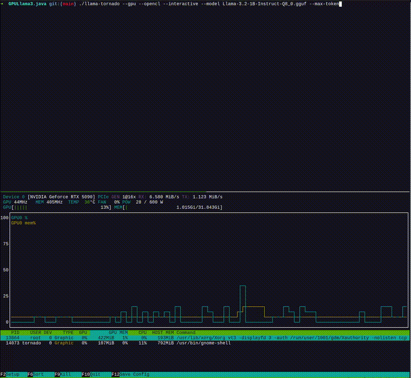
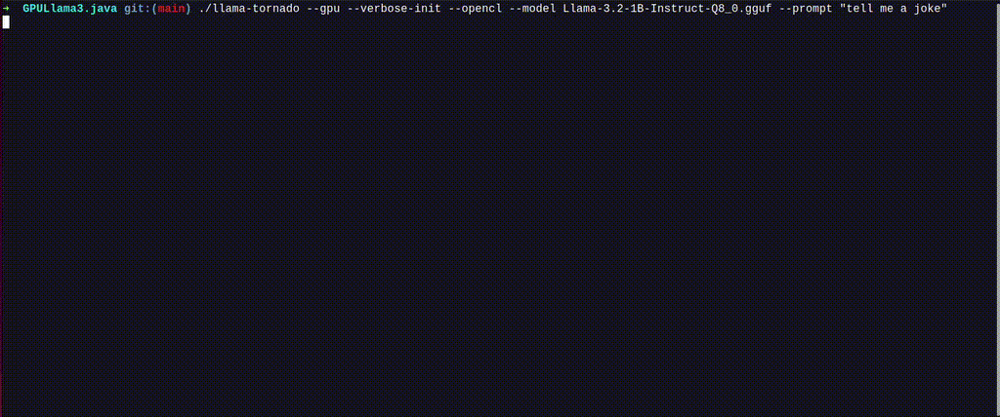

# GPULlama3.java powered by TornadoVM


[](https://hub.docker.com/r/beehivelab/gpullama3.java-nvidia-openjdk-opencl)
[](https://hub.docker.com/r/beehivelab/gpullama3.java-nvidia-openjdk-ptx)
[](https://deepwiki.com/beehive-lab/GPULlama3.java)

-----------
<table style="border: none;">
<tr style="border: none;">
<td style="width: 40%; vertical-align: middle; border: none;">

</td>
<td style="vertical-align: middle; padding-left: 20px; border: none;">  
<strong>Llama3</strong> models written in <strong>native Java</strong> automatically accelerated on GPUs with <a href="https://github.com/beehive-lab/TornadoVM" target="_blank"><strong>TornadoVM</strong></a>.
Runs Llama3 inference efficiently using TornadoVM's GPU acceleration.
<br><br>
Currently, supports <strong>Llama3</strong>, <strong>Mistral</strong>l, <strong>Qwen3</strong> and <strong>Phi3</strong> models in the GGUF format.
<br><br>
Builds on <a href="https://github.com/mukel/llama3.java">Llama3.java</a> by <a href="https://github.com/mukel">Alfonso² Peterssen</a>.
Previous integration of TornadoVM and Llama2 it can be found in <a href="https://github.com/mikepapadim/llama2.tornadovm.java">llama2.tornadovm</a>.
</td>
</tr>
</table>

-----------
#### **[Interactive-mode]** Running on a RTX 5090 with nvtop on bottom to track GPU utilization and memory usage.


-----------
#### **[Instruct-mode]**  Running on a RTX 5090 


----------

### TornadoVM-Accelerated Inference Performance and Optimization Status

We are at the early stages of Java entering the AI world with features added to the JVM that enable faster execution such as GPU acceleration, Vector acceleration, high-performance access to off-heap memory and others.
<br><br>This repository provides the first Java-native implementation of Llama3 that automatically compiles and executes Java code on GPUs via TornadoVM. 
The baseline numbers presented below provide a solid starting point for achieving more competitive performance compared to llama.cpp or native CUDA implementations. 
[Our roadmap](https://github.com/beehive-lab/GPULlama3.java/blob/main/docs/GPULlama3_ROADMAP.md) provides the upcoming set of features that will dramatically improve the numbers below with the clear target being to achieve performance parity with the fastest implementations. 
<br><br>
If you achieve additional performance data points (e.g. new hardware or platforms) please let us know to add them below. 
<br><br>
In addition, if you are interested to learn more about the challenges of managed programming languages and GPU acceleration, you can read [our book](https://link.springer.com/book/10.1007/978-3-031-49559-5) or consult the [TornadoVM educational pages](https://www.tornadovm.org/resources). 


| Vendor / Backend             | Hardware     | Llama-3.2-1B-Instruct | Llama-3.2-3B-Instruct | Optimizations |
|:----------------------------:|:------------:|:---------------------:|:---------------------:|:-------------:|
|                              |              | **FP16**              |       **FP16**        |  **Support**  |
| **NVIDIA / OpenCL-PTX**      | RTX 3070     | 52 tokens/s           |    22.96 tokens/s     |       ✅      |
|                              | RTX 4090     | 66.07 tokens/s        |    35.51 tokens/s     |       ✅      |
|                              | RTX 5090     | 96.65 tokens/s        |    47.68 tokens/s     |       ✅      |
|                              | L4 Tensor    | 52.96 tokens/s        |    22.68 tokens/s     |       ✅      |
| **Intel / OpenCL**           | Arc A770     | 15.65 tokens/s        |     7.02 tokens/s     |      (WIP)    |
| **Apple Silicon / OpenCL**   | M3 Pro       | 14.04 tokens/s        |     6.78 tokens/s     |      (WIP)    |
|                              | M4 Pro       | 16.77 tokens/s        |     8.56 tokens/s     |      (WIP)    |
| **AMD / OpenCL**             | Radeon RX    | (WIP)                 |         (WIP)         |      (WIP)    |

##### ⚠️ Note on Apple Silicon Performance

TornadoVM currently runs on Apple Silicon via [OpenCL](https://developer.apple.com/opencl/), which has been officially deprecated since macOS 10.14.

Despite being deprecated, OpenCL can still run on Apple Silicon; albeit, with older drivers which do not support all optimizations of TornadoVM. Therefore, the performance is not optimal since TornadoVM does not have a Metal backend yet (it currently has OpenCL, PTX, and SPIR-V backends). We recommend using Apple silicon for development and for performance testing to use OpenCL/PTX compatible Nvidia GPUs for the time being (until we add a Metal backend to TornadoVM and start optimizing it).


-----------

## Setup & Configuration

### Prerequisites

Ensure you have the following installed and configured:

- **Java 21**: Required for Vector API support & TornadoVM.
- [TornadoVM](https://github.com/beehive-lab/TornadoVM) with OpenCL or PTX backends.
- [Maven](https://maven.apache.org/): For building the Java project.

### Install, Build, and Run

When cloning this repository, use the `--recursive` flag to ensure that TornadoVM is properly included as submodule:

```bash
# Clone the repository with all submodules
git clone --recursive https://github.com/beehive-lab/GPULlama3.java.git

# Navigate to the project directory
cd GPULlama3.java

# Update the submodules to match the exact commit point recorded in this repository
git submodule update --recursive
```

#### On Linux or macOS
```bash
# Enter the TornadoVM submodule directory
cd external/tornadovm

# Optional: Create and activate a Python virtual environment if needed
python3 -m venv venv
source ./venv/bin/activate

# Install TornadoVM with a supported JDK 21 and select the backends (--backend opencl,ptx).
# To see the compatible JDKs run: ./bin/tornadovm-installer --listJDKs
# For example, to install with OpenJDK 21 and build the OpenCL backend, run: 
./bin/tornadovm-installer --jdk jdk21 --backend opencl

# Source the TornadoVM environment variables
source setvars.sh

# Navigate back to the project root directory
cd ../../

# Source the project-specific environment paths -> this will ensure the correct paths are set for the project and the TornadoVM SDK
# Expect to see: [INFO] Environment configured for Llama3 with TornadoVM at: /home/YOUR_PATH_TO_TORNADOVM
source set_paths

# Build the project using Maven (skip tests for faster build)
# mvn clean package -DskipTests or just make
make

# Run the model (make sure you have downloaded the model file first -  see below)
./llama-tornado --gpu  --verbose-init --opencl --model beehive-llama-3.2-1b-instruct-fp16.gguf --prompt "tell me a joke"
```

#### On Windows
```bash
# Enter the TornadoVM submodule directory
cd external/tornadovm

# Optional: Create and activate a Python virtual environment if needed
python -m venv .venv
.venv\Scripts\activate.bat
.\bin\windowsMicrosoftStudioTools2022.cmd

# Install TornadoVM with a supported JDK 21 and select the backends (--backend opencl,ptx).
# To see the compatible JDKs run: ./bin/tornadovm-installer --listJDKs
# For example, to install with OpenJDK 21 and build the OpenCL backend, run: 
python bin\tornadovm-installer --jdk jdk21 --backend opencl

# Source the TornadoVM environment variables
setvars.cmd

# Navigate back to the project root directory
cd ../../

# Source the project-specific environment paths -> this will ensure the correct paths are set for the project and the TornadoVM SDK
# Expect to see: [INFO] Environment configured for Llama3 with TornadoVM at: C:\Users\YOUR_PATH_TO_TORNADOVM
set_paths.cmd

# Build the project using Maven (skip tests for faster build)
# mvn clean package -DskipTests or just make
make

# Run the model (make sure you have downloaded the model file first -  see below)
python llama-tornado --gpu  --verbose-init --opencl --model beehive-llama-3.2-1b-instruct-fp16.gguf --prompt "tell me a joke"
```
-----------

## ☕ Integration with Your Java Codebase or Tools

To integrate it into your codebase or IDE (e.g., IntelliJ) or custom build system (like IntelliJ, Maven, or Gradle), use the `--show-command` flag.
This flag shows the exact Java command with all JVM flags that are being invoked under the hood to enable seamless execution on GPUs with TornadoVM.
Hence, it makes it simple to replicate or embed the invoked flags in any external tool or codebase.

```bash
llama-tornado --gpu --model beehive-llama-3.2-1b-instruct-fp16.gguf --prompt "tell me a joke" --show-command
```

<details>
<summary>📋 Click to see the JVM configuration </summary>

```java
/home/mikepapadim/.sdkman/candidates/java/current/bin/java \
    -server \
    -XX:+UnlockExperimentalVMOptions \
    -XX:+EnableJVMCI \
    -Xms20g -Xmx20g \
    --enable-preview \
    -Djava.library.path=/home/mikepapadim/manchester/TornadoVM/bin/sdk/lib \
    -Djdk.module.showModuleResolution=false \
    --module-path .:/home/mikepapadim/manchester/TornadoVM/bin/sdk/share/java/tornado \
    -Dtornado.load.api.implementation=uk.ac.manchester.tornado.runtime.tasks.TornadoTaskGraph \
    -Dtornado.load.runtime.implementation=uk.ac.manchester.tornado.runtime.TornadoCoreRuntime \
    -Dtornado.load.tornado.implementation=uk.ac.manchester.tornado.runtime.common.Tornado \
    -Dtornado.load.annotation.implementation=uk.ac.manchester.tornado.annotation.ASMClassVisitor \
    -Dtornado.load.annotation.parallel=uk.ac.manchester.tornado.api.annotations.Parallel \
    -Dtornado.tvm.maxbytecodesize=65536 \
    -Duse.tornadovm=true \
    -Dtornado.threadInfo=false \
    -Dtornado.debug=false \
    -Dtornado.fullDebug=false \
    -Dtornado.printKernel=false \
    -Dtornado.print.bytecodes=false \
    -Dtornado.device.memory=7GB \
    -Dtornado.profiler=false \
    -Dtornado.log.profiler=false \
    -Dtornado.profiler.dump.dir=/home/mikepapadim/repos/gpu-llama3.java/prof.json \
    -Dtornado.enable.fastMathOptimizations=true \
    -Dtornado.enable.mathOptimizations=false \
    -Dtornado.enable.nativeFunctions=fast \
    -Dtornado.loop.interchange=true \
    -Dtornado.eventpool.maxwaitevents=32000 \
    "-Dtornado.opencl.compiler.flags=-cl-denorms-are-zero -cl-no-signed-zeros -cl-finite-math-only" \
    --upgrade-module-path /home/mikepapadim/manchester/TornadoVM/bin/sdk/share/java/graalJars \
    @/home/mikepapadim/manchester/TornadoVM/bin/sdk/etc/exportLists/common-exports \
    @/home/mikepapadim/manchester/TornadoVM/bin/sdk/etc/exportLists/opencl-exports \
    --add-modules ALL-SYSTEM,tornado.runtime,tornado.annotation,tornado.drivers.common,tornado.drivers.opencl \
    -cp /home/mikepapadim/repos/gpu-llama3.java/target/gpu-llama3-1.0-SNAPSHOT.jar \
    com.example.LlamaApp \
    -m beehive-llama-3.2-1b-instruct-fp16.gguf \
    --temperature 0.1 \
    --top-p 0.95 \
    --seed 1746903566 \
    --max-tokens 512 \
    --stream true \
    --echo false \
    -p "tell me a joke" \
    --instruct
```

</details>

-----------

The above model can we swapped with one of the other models, such as `beehive-llama-3.2-3b-instruct-fp16.gguf` or `beehive-llama-3.2-8b-instruct-fp16.gguf`, depending on your needs.
Check models below.

## Download Model Files

Download `FP16` quantized `Llama-3` .gguf files from:
- https://huggingface.co/beehive-lab/Llama-3.2-1B-Instruct-GGUF-FP16
- https://huggingface.co/beehive-lab/Llama-3.2-3B-Instruct-GGUF-FP16
- https://huggingface.co/beehive-lab/Llama-3.2-8B-Instruct-GGUF-FP16

Download `FP16` quantized `Mistral` .gguf files from:
- https://huggingface.co/collections/beehive-lab/mistral-gpullama3java-684afabb206136d2e9cd47e0

Download `FP16` quantized `Qwen3` .gguf files from:
- https://huggingface.co/ggml-org/Qwen3-0.6B-GGUF
- https://huggingface.co/ggml-org/Qwen3-1.7B-GGUF
- https://huggingface.co/ggml-org/Qwen3-4B-GGUF
- https://huggingface.co/ggml-org/Qwen3-8B-GGUF

Please be gentle with [huggingface.co](https://huggingface.co) servers:

**Note** FP16 models are first-class citizens for the current version.
```
# Llama 3.2 (1B) - FP16
wget https://huggingface.co/beehive-lab/Llama-3.2-1B-Instruct-GGUF-FP16/resolve/main/beehive-llama-3.2-1b-instruct-fp16.gguf

# Llama 3.2 (3B) - FP16 
wget https://huggingface.co/beehive-lab/Llama-3.2-3B-Instruct-GGUF-FP16/resolve/main/beehive-llama-3.2-3b-instruct-fp16.gguf

# Llama 3 (8B) - FP16 
wget https://huggingface.co/beehive-lab/Llama-3.2-8B-Instruct-GGUF-FP16/resolve/main/beehive-llama-3.2-8b-instruct-fp16.gguf

# Mistral (7B) - FP16
wget https://huggingface.co/MaziyarPanahi/Mistral-7B-Instruct-v0.3-GGUF/resolve/main/Mistral-7B-Instruct-v0.3.fp16.gguf

# Qwen3 (0.6B) - FP16
wget https://huggingface.co/ggml-org/Qwen3-0.6B-GGUF/resolve/main/Qwen3-0.6B-f16.gguf

# Qwen3 (1.7B) - FP16
wget https://huggingface.co/ggml-org/Qwen3-0.6B-GGUF/resolve/main/Qwen3-1.7B-f16.gguf

# Qwen3 (4B) - FP16
wget https://huggingface.co/ggml-org/Qwen3-0.6B-GGUF/resolve/main/Qwen3-4B-f16.gguf

# Qwen3 (8B) - FP16
wget https://huggingface.co/ggml-org/Qwen3-0.6B-GGUF/resolve/main/Qwen3-8B-f16.gguf

# Phi-3-mini-4k - FP16
wget https://huggingface.co/microsoft/Phi-3-mini-4k-instruct-gguf/resolve/main/Phi-3-mini-4k-instruct-fp16.gguf
```

**[Experimental]** you can download the Q8 and Q4 used in the original implementation of Llama3.java, but for now are going to be dequanted to FP16 for TornadoVM support:
```
# Llama 3.2 (1B) - Q4_0
curl -L -O https://huggingface.co/mukel/Llama-3.2-1B-Instruct-GGUF/resolve/main/Llama-3.2-1B-Instruct-Q4_0.gguf
# Llama 3.2 (3B) - Q4_0 
curl -L -O https://huggingface.co/mukel/Llama-3.2-3B-Instruct-GGUF/resolve/main/Llama-3.2-3B-Instruct-Q4_0.gguf
# Llama 3 (8B) - Q4_0 
curl -L -O https://huggingface.co/mukel/Meta-Llama-3-8B-Instruct-GGUF/resolve/main/Meta-Llama-3-8B-Instruct-Q4_0.gguf
# Llama 3.2 (1B) - Q8_0 
curl -L -O https://huggingface.co/mukel/Llama-3.2-1B-Instruct-GGUF/resolve/main/Llama-3.2-1B-Instruct-Q8_0.gguf
# Llama 3.1 (8B) - Q8_0 
curl -L -O https://huggingface.co/mukel/Meta-Llama-3.1-8B-Instruct-GGUF/resolve/main/Meta-Llama-3.1-8B-Instruct-Q4_0.gguf
```

-----------

## Running `llama-tornado`

To execute Llama3, or Mistral models with TornadoVM on GPUs use the `llama-tornado` script with the `--gpu` flag.

### Usage Examples

#### Basic Inference
Run a model with a text prompt:

```bash
./llama-tornado --gpu --verbose-init --opencl --model beehive-llama-3.2-1b-instruct-fp16.gguf --prompt "Explain the benefits of GPU acceleration."
```

#### GPU Execution (FP16 Model)
Enable GPU acceleration with Q8_0 quantization:
```bash
./llama-tornado --gpu  --verbose-init --model beehive-llama-3.2-1b-instruct-fp16.gguf --prompt "tell me a joke"
```

-----------

## 🐳 Docker

You can run `GPULlama3.java` fully containerized with GPU acceleration enabled via **OpenCL** or **PTX** using pre-built Docker images.
More information as well as examples to run with the containers are available at [docker-gpullama3.java](https://github.com/beehive-lab/docker-gpullama3.java).

### 📦 Available Docker Images

| Backend | Docker Image | Pull Command |
|--------|---------------|---------------|
| **OpenCL** | [`beehivelab/gpullama3.java-nvidia-openjdk-opencl`](https://hub.docker.com/r/beehivelab/gpullama3.java-nvidia-openjdk-opencl) | `docker pull beehivelab/gpullama3.java-nvidia-openjdk-opencl` |
| **PTX (CUDA)** | [`beehivelab/gpullama3.java-nvidia-openjdk-ptx`](https://hub.docker.com/r/beehivelab/gpullama3.java-nvidia-openjdk-ptx) | `docker pull beehivelab/gpullama3.java-nvidia-openjdk-ptx` |

#### Example (OpenCL)

```bash
docker run --rm -it --gpus all \
  -v "$PWD":/data \
  beehivelab/gpullama3.java-nvidia-openjdk-opencl \
  /gpullama3/GPULlama3.java/llama-tornado \
  --gpu --verbose-init \
  --opencl \
  --model /data/Llama-3.2-1B-Instruct.FP16.gguf \
  --prompt "Tell me a joke"
```
-----------

## Troubleshooting GPU Memory Issues

### Out of Memory Error

You may encounter an out-of-memory error like:
```
Exception in thread "main" uk.ac.manchester.tornado.api.exceptions.TornadoOutOfMemoryException: Unable to allocate 100663320 bytes of memory.
To increase the maximum device memory, use -Dtornado.device.memory=<X>GB
```

This indicates that the default GPU memory allocation (7GB) is insufficient for your model.

### Solution

First, check your GPU specifications. If your GPU has high memory capacity, you can increase the GPU memory allocation using the `--gpu-memory` flag:

```bash
# For 3B models, try increasing to 15GB
./llama-tornado --gpu --model beehive-llama-3.2-3b-instruct-fp16.gguf --prompt "Tell me a joke" --gpu-memory 15GB

# For 8B models, you may need even more (20GB or higher)
./llama-tornado --gpu --model beehive-llama-3.2-8b-instruct-fp16.gguf --prompt "Tell me a joke" --gpu-memory 20GB
```

### GPU Memory Requirements by Model Size

| Model Size  | Recommended GPU Memory |
|-------------|------------------------|
| 1B models   | 7GB (default)          |
| 3-7B models | 15GB                   |
| 8B models   | 20GB+                  |

**Note**: If you still encounter memory issues, try:

1. Using Q4_0 instead of Q8_0 quantization (requires less memory).
2. Closing other GPU-intensive applications in your system.

-----------

## Command Line Options

Supported command-line options include:

```bash
cmd ➜ llama-tornado --help
usage: llama-tornado [-h] --model MODEL_PATH [--prompt PROMPT] [-sp SYSTEM_PROMPT] [--temperature TEMPERATURE] [--top-p TOP_P] [--seed SEED] [-n MAX_TOKENS]
                     [--stream STREAM] [--echo ECHO] [-i] [--instruct] [--gpu] [--opencl] [--ptx] [--gpu-memory GPU_MEMORY] [--heap-min HEAP_MIN] [--heap-max HEAP_MAX]
                     [--debug] [--profiler] [--profiler-dump-dir PROFILER_DUMP_DIR] [--print-bytecodes] [--print-threads] [--print-kernel] [--full-dump]
                     [--show-command] [--execute-after-show] [--opencl-flags OPENCL_FLAGS] [--max-wait-events MAX_WAIT_EVENTS] [--verbose]

GPU-accelerated LLaMA.java model runner using TornadoVM

options:
  -h, --help            show this help message and exit
  --model MODEL_PATH    Path to the LLaMA model file (e.g., beehive-llama-3.2-8b-instruct-fp16.gguf) (default: None)

LLaMA Configuration:
  --prompt PROMPT       Input prompt for the model (default: None)
  -sp SYSTEM_PROMPT, --system-prompt SYSTEM_PROMPT
                        System prompt for the model (default: None)
  --temperature TEMPERATURE
                        Sampling temperature (0.0 to 2.0) (default: 0.1)
  --top-p TOP_P         Top-p sampling parameter (default: 0.95)
  --seed SEED           Random seed (default: current timestamp) (default: None)
  -n MAX_TOKENS, --max-tokens MAX_TOKENS
                        Maximum number of tokens to generate (default: 512)
  --stream STREAM       Enable streaming output (default: True)
  --echo ECHO           Echo the input prompt (default: False)
  --suffix SUFFIX       Suffix for fill-in-the-middle request (Codestral) (default: None)

Mode Selection:
  -i, --interactive     Run in interactive/chat mode (default: False)
  --instruct            Run in instruction mode (default) (default: True)

Hardware Configuration:
  --gpu                 Enable GPU acceleration (default: False)
  --opencl              Use OpenCL backend (default) (default: None)
  --ptx                 Use PTX/CUDA backend (default: None)
  --gpu-memory GPU_MEMORY
                        GPU memory allocation (default: 7GB)
  --heap-min HEAP_MIN   Minimum JVM heap size (default: 20g)
  --heap-max HEAP_MAX   Maximum JVM heap size (default: 20g)

Debug and Profiling:
  --debug               Enable debug output (default: False)
  --profiler            Enable TornadoVM profiler (default: False)
  --profiler-dump-dir PROFILER_DUMP_DIR
                        Directory for profiler output (default: /home/mikepapadim/repos/gpu-llama3.java/prof.json)

TornadoVM Execution Verbose:
  --print-bytecodes     Print bytecodes (tornado.print.bytecodes=true) (default: False)
  --print-threads       Print thread information (tornado.threadInfo=true) (default: False)
  --print-kernel        Print kernel information (tornado.printKernel=true) (default: False)
  --full-dump           Enable full debug dump (tornado.fullDebug=true) (default: False)
  --verbose-init        Enable timers for TornadoVM initialization (llama.EnableTimingForTornadoVMInit=true) (default: False)

Command Display Options:
  --show-command        Display the full Java command that will be executed (default: False)
  --execute-after-show  Execute the command after showing it (use with --show-command) (default: False)

Advanced Options:
  --opencl-flags OPENCL_FLAGS
                        OpenCL compiler flags (default: -cl-denorms-are-zero -cl-no-signed-zeros -cl-finite-math-only)
  --max-wait-events MAX_WAIT_EVENTS
                        Maximum wait events for TornadoVM event pool (default: 32000)
  --verbose, -v         Verbose output (default: False)

```

## Debug & Profiling Options
View TornadoVM's internal behavior:
```bash
# Print thread information during execution
./llama-tornado --gpu --model model.gguf --prompt "..." --print-threads

# Show bytecode compilation details
./llama-tornado --gpu --model model.gguf --prompt "..." --print-bytecodes

# Display generated GPU kernel code
./llama-tornado --gpu --model model.gguf --prompt "..." --print-kernel

# Enable full debug output with all details
./llama-tornado --gpu --model model.gguf --prompt "..." --debug --full-dump

# Combine debug options
./llama-tornado --gpu --model model.gguf --prompt "..." --print-threads --print-bytecodes --print-kernel
```

## Current Features & Roadmap

  - **Support for GGUF format models** with full FP16 and partial support for Q8_0 and Q4_0 quantization.
  - **Instruction-following and chat modes** for various use cases.
  - **Interactive CLI** with `--interactive` and `--instruct` modes.
  - **Flexible backend switching** - choose OpenCL or PTX at runtime (need to build TornadoVM with both enabled).
  - **Cross-platform compatibility**:
    - ✅ NVIDIA GPUs (OpenCL & PTX )
    - ✅ Intel GPUs (OpenCL)
    - ✅ Apple GPUs (OpenCL)

Click [here](https://github.com/beehive-lab/GPULlama3.java/tree/main/docs/TORNADOVM_TRANSFORMER_OPTIMIZATIONS.md) to view a more detailed list of the transformer optimizations implemented in TornadoVM.

Click [here](https://github.com/beehive-lab/GPULlama3.java/tree/main/docs/GPULlama3_ROADMAP.md) to see the roadmap of the project.

-----------

## Acknowledgments

This work is partially funded by the following EU & UKRI grants (most recent first):

- EU Horizon Europe & UKRI [AERO 101092850](https://aero-project.eu/).
- EU Horizon Europe & UKRI [P2CODE 101093069](https://p2code-project.eu/).
- EU Horizon Europe & UKRI [ENCRYPT 101070670](https://encrypt-project.eu).
- EU Horizon Europe & UKRI [TANGO 101070052](https://tango-project.eu).

-----------

## License

MIT
